Introduction
============

This lab is designed to introduce you to the basics of debugging your
code and binary heaps. By the end of this lab, you will be expected to
understand how to create and maintain a heap as well as understand some
simple code debugging and memory error tracing.

In this lab you are expected to perform the basics of cloning your Lab 8
repository from the GitLab course group. A link to the course group can
be found
[here](https://git.cs.dal.ca/courses/2022-winter/csci-2122)
and your repository can be found in the Lab8 subgroup. See the Lab
Technical Document for more information on using git. You will notice
that your repository has a file in the **Lab8** directory named
**delete\_this\_file**. Due to the limitations of GitLab, we are not
able to push completely empty directories. Before you push your work to
your repository (which should be in the **Lab8** directory anyway), make
sure to first use the **git rm** command to remove the extra file. If
you do not, your pipeline could fail.

**Be sure to read this entire document before starting!**

Table of Contents
===============================

[[_TOC_]]

GDB -- The GNU Project Debugger
===============================

The GDB software available on Timberlea is meant to be paired with the
gcc compiler on Timberlea to ensure the proper operation of your
programs at runtime. It provides you access to annotated memory, stack,
function, and variable access so that you can trace the flow of your
program and diagnose any bugs or memory errors. In the following
sections you will find information on how to use gdb, as well as an
example of a typical program error trace.

Compiling for GDB
-----------------

In order for a program to be compiled so that it's easily accessed by
gdb, you must compile it with the additional **-g** option in gcc. This
loads a symbol table into your program and provides source paths to your
various source files. During execution on gdb, having a full symbol
table and access to your source code allows gdb to provide source-based
context so you are able to see where the program has currently executed
up to.

Starting GDB
------------

To start GDB, enter the command **gdb** into the Unix terminal.
Alternatively, if you know what file you would like to debug, you can
use **gdb filename**.

It's also possible to have **gdb** execute a batch file, which is a file
containing a command on each line, to be executed in order. In order to
run a batch file (which is how this lab executes your **gdb**
instructions), you can use the **gdb -batch -x batch\_file\_name**
command. This method requires the first line of your batch file to be a
*file* command with a path to the program you want to debug.

GDB Commands
------------

### Basic Commands

The following basic commands are entered from the main gdb prompt. They
allow you to open files (for execution), read information on various
commands, and exit the program.

| Command         | Function                                    | Example Usage |
| ------          | ------                                      | ------        | 
| file *filename* | Selects a file to debug.                    | file runme    |
| help *command*  | Displays a held page for the given command. | help break    |
| quit            | Exits GDB.                                  | quit          |

### Breakpoints

A breakpoint tells the debugger to pause program execution when it
reaches a specific location in code, often a certain line in a file or a
specific function. This allows you to examine the state of your program
at that point of execution. When GDB encounters a breakpoint, it pauses
program execution before executing that line of code. For example, if
there is a breakpoint on line 27 of some program, GDB will pause after
executing line 26.

| **Command**                 | **Function**                                                           | **Example Usage**     |
| ------                      | ------                                                                 | ------                | 
| break *linenumber*          | Sets a breakpoint in the current file at the given line number.        |  break 18             |
| break *filename:linenumber* | Sets a breakpoint in the given file, at the given line number.         |  break filename.c:197 |
| break *function*            | Sets a breakpoint at the first line of the given function.             |  break main           |
| info breakpoints            | Displays a numbered list of all breakpoints currently set.             |  info breakpoints     |
| delete *number*             | Removes the nth breakpoint (where n is given by **info breakpoints**)  |  delete 3             |
| clear *linenumber*          | Removes the breakpoint in the current file from the given line number. |  clear 18             |
| clear *filename:linenumber* | Removes the breakpoint from the given file, at the given line number.  |  clear filename.c:197 |
| clear *function*            | Removes the breakpoint from the first line of the given function.      |  clear main           |

### Navigating Execution

The following commands allow you to move through your code so you can
see the state as each line or instruction is executed. Some of these
commands have shorthand versions (such as **next** having an alias of
**n**), but the full command names will be given here for the sake of
completeness.

| **Command** | **Function**                                                                                                                                         | **Example Usage** |
| -----       | ------                                                                                                                                               | ------            |
|  run        | Starts program execution.                                                                                                                            | run               |
|  step       | Executes the next line of code. If the next line of code is a function call, GDB steps to the first line of code for that function.                  | step              |
|  stepi      | Executes the next instruction. If the next instruction is a function call, GDB steps into the first instruction for that function.                   | stepi             |
|  next       | Executes the next line of code. If the next line of code is a function call, GDB treats it as one line of code, and does not step into the function. | next              |
|  nexti      | Executes the next instruction. If the next instruction is a function call, GDB treats it as one instruction, and does not step into the function.    | nexti             |
|  continue   | Continues program execution until another breakpoint is reached, or until the end of the program if no breakpoints are found.                        | continue          |
|  finish     | If in a function call, executes the rest of the function and steps out of the function.                                                              | finish            |
|  until      | If called from the last line of a loop, **until** continues program execution until the loop is exited.                                              | until             |
|  kill       | Stops the program that is currently running.                                                                                                         | kill              |

### Analysis and Assignment

The following commands allow you to print variable states to the screen,
read through the program stack, and set values in memory. They can be
useful for analyzing and circumventing code structures to better
understand the state of the machine at any given time during execution.

| **Command**                  | **Function**                                                                      | **Example Usage**   |
| ------                       | ------                                                                            | ------              |
| print */format* *variable*   | Prints the value of the given variable, in the given format.                      | print /s someString |
| backtrace                    | Prints the function calls leading up to an error.                                 | backtrace           | 
| where                        | The same as backtrace.                                                            | where               |  
| x/*format* *memoryaddress*   | Prints the contents of a specific memory address or register.                     | x/x \$rsi           |
| display *variable*           | Prints the value of the given variable each time the program pauses execution.    | display pog         |
| set var *variable* = *value* | Sets the value of a variable in memory to the specified value.                    | set var pog = 16    |
| watch *variable*             | Tells GDB to pause program execution whenever the given variable's value changes. | watch pog           |

| **Specifier** | **Format**                       |
| ------        | ------                           |
| a             |  pointer                         |
| c             |  print an integer as a character |
| d             |  signed integer                  |
| f             |  floating point number           |
| o             |  print an integer as octal       |
| s             |  string                          |
| t             |  print an integer as binary      |
| u             |  unsigned integer                |
| x             |  print an integer as hexadecimal |

Tracing a Segmentation Fault Example
------------------------------------

A very useful feature of GDB is its ability to trace segmentation
faults. In this section we will provide an example of how to track down
segmentation faults as they happen during code execution.

To start, you may find it useful to download the example code to your
machine. To get the source code for the following example, open your SSH
client, sign into Timberlea, and perform the following commands in the
directory of your choice:

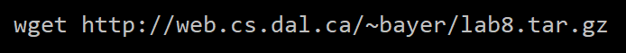

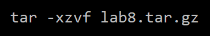

In the following example, a student is trying to write a program to
compare the amount of time it takes to populate a 2D array of chars
using a row-wise traversal, versus a column-wise traversal. The program
compiles, but when the student tries to run the program, the program
produces a segmentation fault. The program is made up of three files:
**array\_comparison\_main.c**, **array\_comparison.c**, and
**array\_comparison.h**. The contents of each file are as follows:

### array\_comparison\_main.c

```c
#include <stdio.h>
#include <stdlib.h>
#include <stdbool.h>
#include <time.h>
#include "array_comparison.h"

int main()
{
    // Initialize the square 2D array.
    Array2D* arr = initialize_array(30000);
        
    // Allocate space. 
    allocate_space(arr);
    
    // Get the current time.
    time_t time1 = time(NULL);
    
    // Traverse the 2D array by row, then column, and store 'a' in each 
    // position.
    for (int row = 0; row < arr->dimension; row++) {
        for (int col = 0; col < arr->dimension; col++) {
            arr->data[row][col] = 'a';
        }
    }
    
    // Get the current time.
    time_t time2 = time(NULL);
    
    // Calculate the amount of time it took by subtracting
    // the second time from the first with the difftime function.
    double rowTime = difftime(time2, time1);
    
    printf("\nTime taken to traverse by row: %.2f seconds.\n", rowTime);
    
    // Clear the array so we can put new values in it.
    clear_array(arr);
    
    // Get the current time. 
    time_t time3 = time(NULL);

    // Traverse the 2D array by row, then column, and store 'b' in each 
    // position.
    for (int row = 0; row < arr->dimension; row++) {
        for (int col = 0; col < arr->dimension; col++) {
            arr->data[col][row] = 'b';
        }
    }
    
    // Get the current time again.
    time_t time4 = time(NULL);
    
    // Calculate the amount of time it took by subtracting
    // the second time from the first with the difftime function.
    double columnTime = difftime(time4, time3);
    
    // Print how much time it took. 
    printf("Time taken to traverse by column: %.2f seconds.\n", columnTime);

    // Print the faster traversal method.
    if(rowTime < columnTime)
    {
        printf("\nRow traversal is faster by %.2f seconds.\n\n", (columnTime - rowTime));
    }
    else
    {
        printf("\nColumn traversal is faster by %.2f seconds.\n\n", (rowTime - columnTime));
    }
    
    // Make sure all of the memory has been freed.
    destroy_array(arr);
}
```

### array\_comparison.c

```c
#include <stdio.h>
#include <stdlib.h>
#include <stdbool.h>
#include <time.h>
#include "array_comparison.h"

// Initialize the 2D array.
Array2D* initialize_array(int dim)
{
    Array2D* arr = malloc(sizeof *arr);
    if(arr == NULL)
        return NULL;
    
    arr->dimension = dim;
    arr->data = NULL;
    return arr;
}

void allocate_space(Array2D* arr)
{
    // Allocate enough space to hold (dimension) pointers.
    arr->data = malloc(sizeof *(arr->data) * arr->dimension);
    
    // Allocate the rest of the array.
    for (int i = 0; i < arr->dimension; i++)
    {
        arr->data[i] = malloc(sizeof *(arr->data[i]) * arr->dimension);
    }
}


bool clear_array(Array2D* arr)  
{
    if(arr == NULL)
        return true;

    //Free each allocated entry. 
    for(int i=0; i < arr->dimension; i++)
        free(arr->data[i]);

    free(arr->data);
    return true;
}

bool destroy_array(Array2D* arr)
{
    if(arr == NULL)
        return true;
    
    // Make sure the array was cleared first.
    clear_array(arr);
    
    free(arr);
    
    return true;
}
```

### array\_comparison.h

```c
#ifndef __ARRAY_HEADER
#define __ARRAY_HEADER

typedef struct _Array
{
    char** data;
    int dimension;  
} Array2D;

Array2D* initialize_array(int);
bool clear_array(Array2D*);
bool destroy_array(Array2D*);
void allocate_space(Array2D*);

#endif
```

To compile this program, the student used:

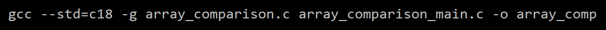

To run the program, the student used:

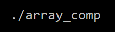

Finally, the program output was:

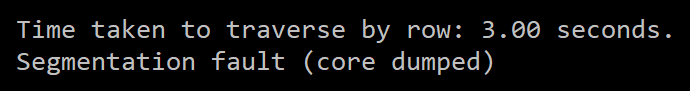

### Finding the Error with GDB

At this point, we can use gdb to track down the error and why it's
happening. Begin by starting **gdb** with the program name as the first
argument:

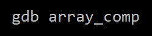

When gdb first starts, you should see the following screen. Because we
have compiled using **gcc** and the **-g** option, our program has
access to our source code and symbols, which are useful for the
debugging process. You can see them load at the bottom of the image.

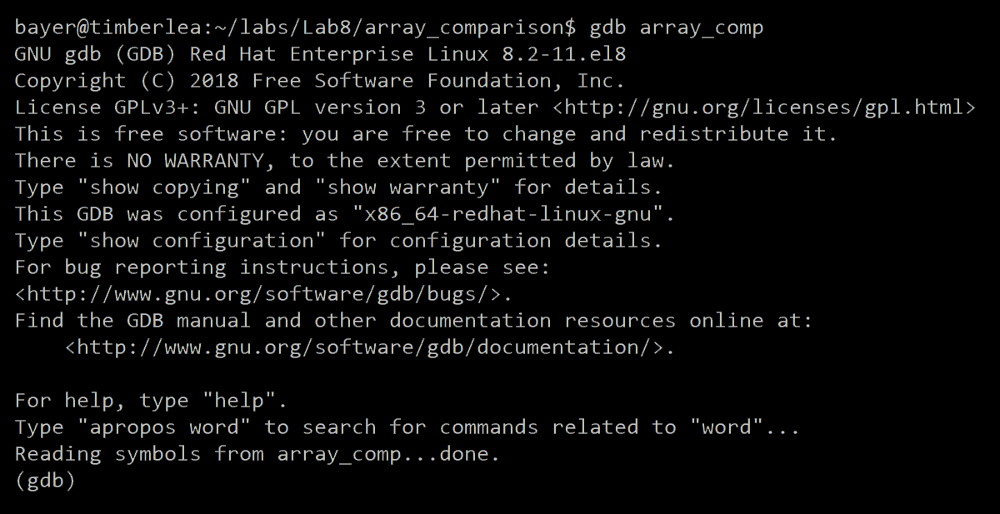

Since we know the program will produce a segmentation fault, we can run
it without setting any breakpoints by simply executing a **run**
command:

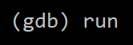

The program outputs the time taken for the row-wise traversal correctly,
but runs into a segmentation fault before it can output the time taken
for a column-wise traversal. gdb displays which line caused the
segmentation fault:

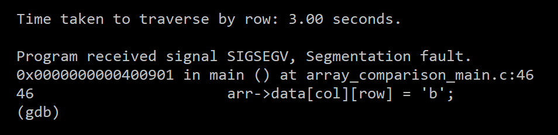

However, if the segmentation fault was in a different function, the
**backtrace** command would tell us the order in which functions were
called before the segmentation fault occurred:

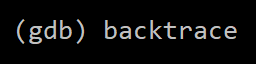

We can see the output from the **backtrace** command here:

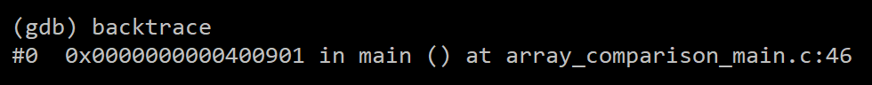

So, now we know what line is producing the segmentation fault:

`46. arr ->data[col][row] = 'b';`

But, why is this line producing a segmentation fault? Line 22 in the
same program didn't produce a segmentation fault. We can use gdb again,
and this time we can step through the program, line by line. Our program 
is still running, so we'll use the **kill** command to stop execution.

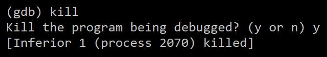

Start by adding a breakpoint to the first line of code in the main function:

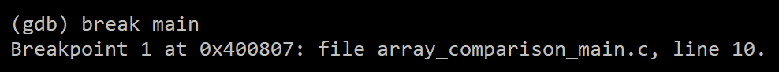

Then, run the program once more:

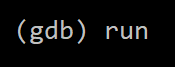

On this execution, gdb has paused the program execution before executing
line 10. gdb also displays the code that is on line 10, as it has direct
access to our source files.

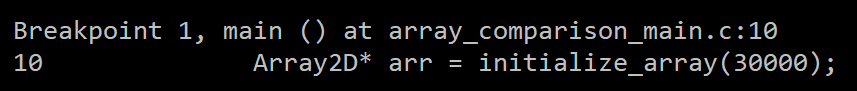

The **list** command shows 10 lines of code around where the program has
paused in execution.

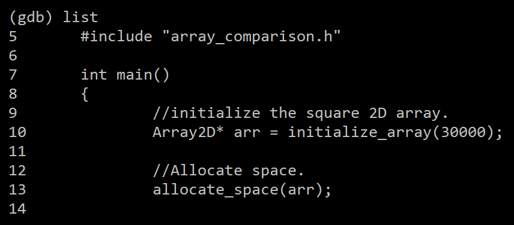

We can continue moving through the code, using **list** repeatedly to
help us keep track of where we are.

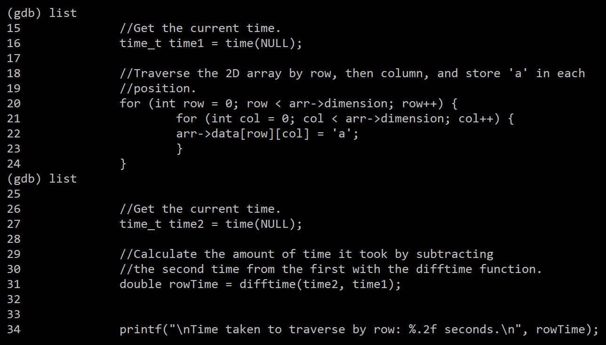

Now, we can see where the last successful print statement occurred: line
34. We can add a break point there.

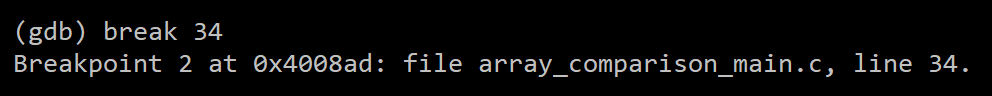

Next, we'll tell gdb to continue program execution until it reaches the
breakpoint at line 34 by using the **continue** command.

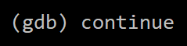

After a moment of processing, gdb has paused program execution before
executing line 34.

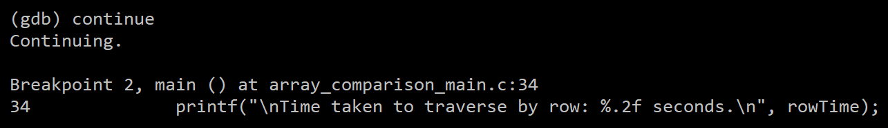

We know that line 34 works as expected, so we can use the **next**
command to execute it.

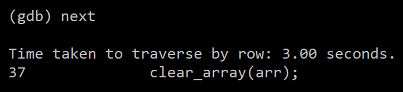

Line 37 is a call to a function, **clear\_array**, in
**array\_comparison.c**. The **step** command will bring us to the first
line of the **clear\_array** function, but it won't execute it. You can
think of the step command as \"stepping into\" a function when possible.

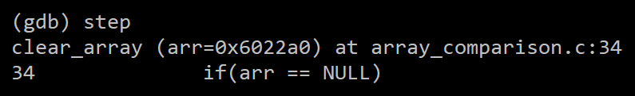

There's a loop in this code. Don't type **step** and **next** 30,000
times. We use **next** to execute line 39 instead of **step** because we
do not want to step into the **free** function.

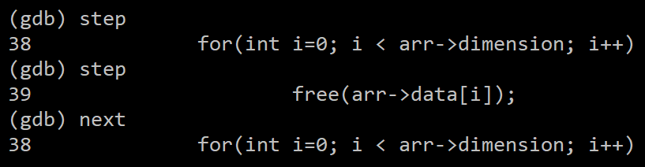

We can use the **until** command to skip to the end of the loop. Now all
of the memory in the 2D array has been freed. Do you see what the
problem might be?

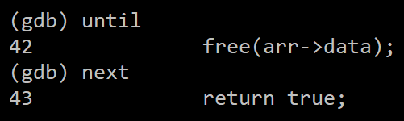

Use **step** a few more times to get to the line that produces the
segmentation fault.

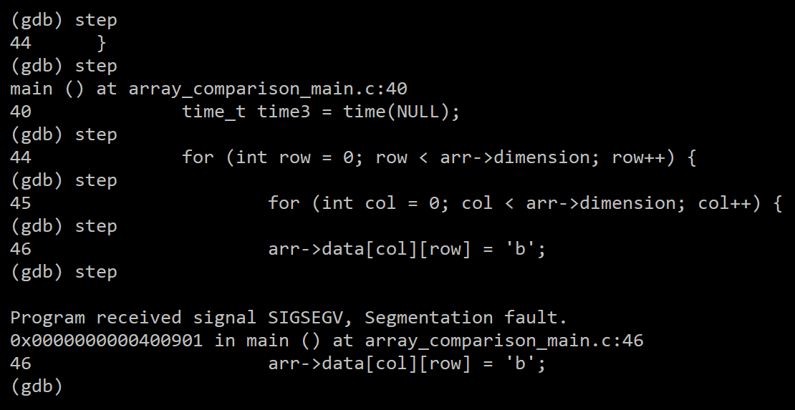

The segmentation fault occurs the very first time we try to write to
-\>data\[col\]\[row\]@ There's no memory allocated for any entries of
-\>data@ because we freed all of the pointers during the
**clear\_array** function, but didn't allocate any new memory.

We can fix this error by modifying our program to call the
**allocate\_space** function.

Other Debugging Tools
=====================

Timberlea has several other tools for managing memory and
viewing underlying code in a more structured way than via the compiler.
Two programs we'll talk about here are Valgrind and objdump. When you
are attempting to use these tools, it's always best to start with a
**-g** option on your gcc commands. This allows these debugging tools
access to useful information in your executable, such as line numbers.

Always be careful when executing your compiler with **-g**, as it's not
always obvious what the default level of optimization in your compiler
might be. If you are getting references to line numbers (in Valgrind,
but also gdb) that don't make sense in the context of your program
execution, it may be because the optimization level is being increased
and the line numbers are losing accuracy. If you are running this
problem, it may be useful for you to apply the **-O0** (that's dash,
capital O, zero) to set your compiler to perform no optimization (making
your program run slower) in exchange for more accurate reporting during
the debugging process. If you are still having trouble **-Og** sets the
optimization level to be best suited for debugging, while potentially
making your software slower.

Valgrind
--------

Valgrind is a software suite for Linux memory boundary testing and
program profiling. The most used feature in Valgrind is the Memcheck
feature, which it executes by default. We will not go into large amounts
of detail on Valgrind here, but we will walk through a simple example of
using it on the Birthday contract executable,
**happy\_birthday\_geralt**.

By default, Valgrind can be executed using **valgrind program\_name**,
where **program\_name** is the name of the executable you would like to
debug. In the case of **happy\_birthday\_geralt**, we can see a fully
memory execution here:

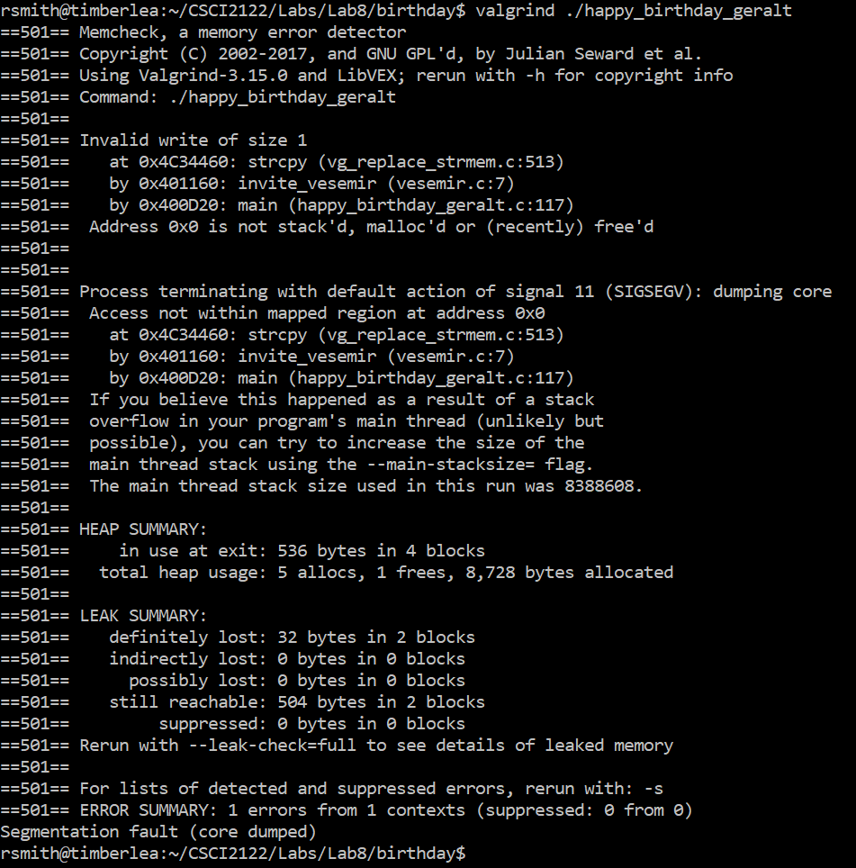

We can break this down by section, so we know what Valgrind is telling
us when this program executes. First, Valgrind tells us the current tool
(Memcheck), the current license, the Valgrind version, and the command
we have executed to start the program:

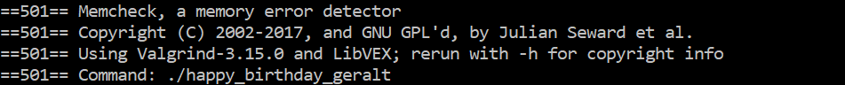

The next section of the Valgrind output informs us that an error has
occurred, specifically an invalid write. This generally means that you
have tried to store something into a memory location that you do not
own. It will produce a stack trace leading up to the error location, as
well as a reason for the memory error's occurrence:

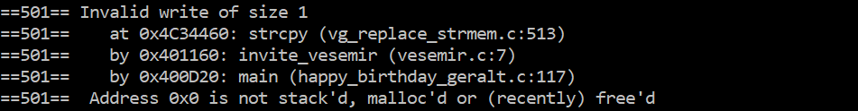

Using this information, it appears that the program has executed the
*main* function (found in **happy\_birthday\_geralt.c**), and it has
called a function at line 117 named *invite\_vesemir* inside the
**vesemir.c** source file. At line 7 in that source file, it attempted
to execute a *strcpy* function call, which resulted in an invalid memory
write. Since *strcpy* specifically attempts to write into the memory
location supplied as the first parameter (via a pointer), it is likely
from the error that the pointer passed to *strcpy* has either not been
allocated memory via malloc (or calloc), or has been free'd and thus
would need to be allocated again. We can use this information to check
our source code and narrow down the issue we're having with memory.

Since not all memory errors will cause the program to crash, Valgrind
will happily report as many issues as it can. However, the next section
confirms that the invalid write has forced the program to close:

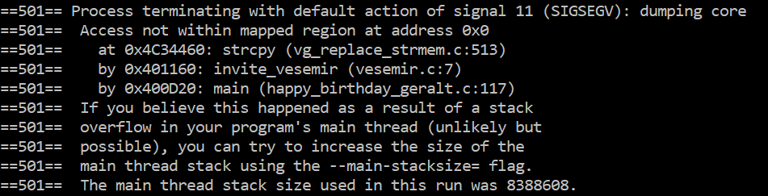

A signal 11 is a Unix code which can be triggered and sent to programs
as they're executing. Unix attaches a piece of code to your program
which is capable of handling these signals as they're received. In this
case, the signal 11 that we have received is referred to as a Signal 11
(SIGSEGV), or a Segmentation Violation. This means that Unix has
detected you attempting to access memory which your program does not
own, and thus forces your program to close (which is the default
handling behaviour for a SIGSEGV). It confirms the exact stack trace
(again) which caused the error to happen, and also gives some advice for
the situation in which it is not a program error, but a system error
instead. It's also possible to run into Segmentation Violation errors
when hardware in your system is failing, but user error in programming
is far, far more likely.

In the next section, we see a printout of the total heap space used by
the program. It registered five memory allocations to the heap (malloc
or calloc), a single *free* call, and tells us the number of total bytes
allocated to the heap by the program.


Next, Valgrind will alert you to how much memory has been leaked by your
program. These numbers can refer to the amount of space you have lost by
losing pointers it has been keeping track of, but can also read out some
\"left over\" segments lost during malloc's blocking process, since
malloc may not always guarantee a \"perfect\" block of memory has been
given. You may notice sometimes that you allocate, for example, 10 bytes
to a char\*, but the system will let you write a few extra bytes
(characters) into your string before it decides to throw an error at
you, leading to confusing behaviour. This is because malloc actually
reserves blocks of memory scaled by the word size of your system and if 
your data doesn't fit exactly to its allocation strategy, it may need to
put a zero fill on the end of the memory segment to give you enough space. 
This space is still technically usable by you (but don't do it!), which 
could be seen as a memory loss by the system.

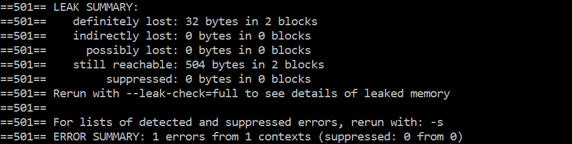

Finally, Valgrind will also list for you the number of errors it
discovered. In this case we received a single full error (our invalid
write) and it only occurred in a single location. If you had more
\"soft\" memory errors which do not necessarily lead to a program halt,
you will be given a tally here. As is standard, you can view more usage
information on Valgrind by using the **man valgrind** command on Unix.
You can also visit their website
[here](https://valgrind.org/).

objdump
-------

The **objdump** program is a Unix command which is capable of converting
.o object files into their equivalent assembly code, along with a few
additional pieces of useful information.

The objdump program has a built-in disassembler, which will take any
binary (generally .o) file you desire and converts it back to its
assembly structure. In doing so, it will break down the assembly code by
individual function used within the binary file. Since it is breaking
down information via program offsets, it can be a useful tool in
conjunction with **gdb**, as it can give you insight into the instructions
being executed while inside a function. It's also useful for getting
function names and program offsets so you can more easily
view/breakpoint those locations when debugging your program via **gdb**.

In order to run **objdump**, the simplest method is to trigger the
disassembler by using **objdump -d program\_name**. In the case of the
Birthday contract's program, we can run **objdump -d
happy\_birthday\_geralt**. When you run this, your terminal will likely
not have a long enough text buffer to store all of the data produced, so
we recommend either redirecting the output into a file (using **>**) or
piping it into the **less** Unix program, which will let you view the
entire contents in a scrollable viewer. For example, when we run this
command on the **happy\_birthday\_geralt** program, we can find
disassembled functions such as:

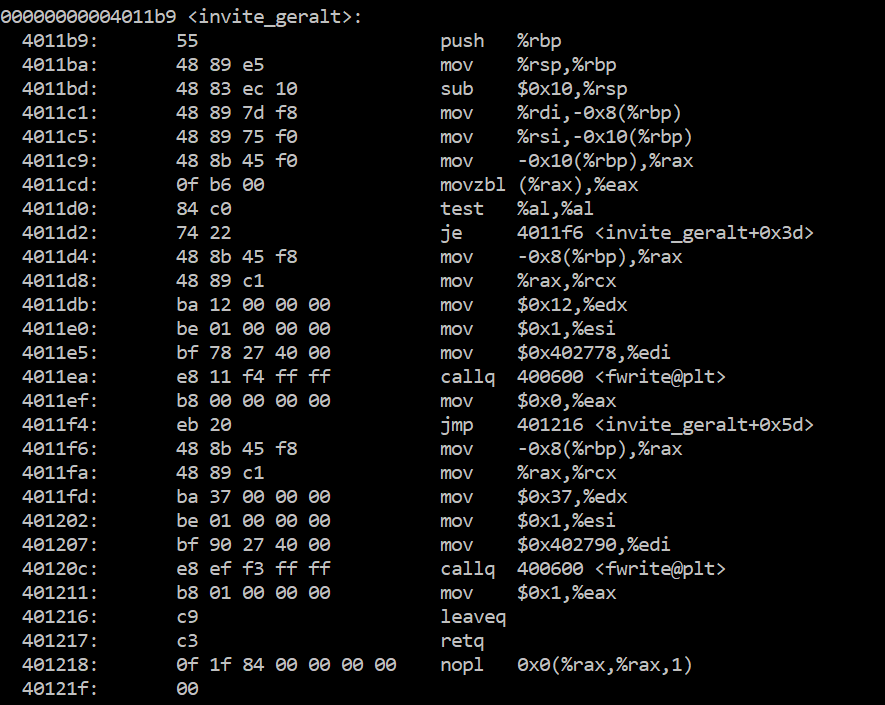

In the above printout, we can see there's a function named
**invite\_geralt** which begins at a program offset of 4011b9 (a memory
address written in hexadecimal format). It then shows that there are 27
assembly instructions used to define this function, where the first
column is the offset of the assembly instruction (technically in
absolute value, but which can be interpreted also as an offset to the
**invite\_geralt** function with some simple math), the machine code
values of the given instruction, followed by the assembly equivalent of
that machine code instruction. Using this in conjunction with gdb can
make your life easier when setting breakpoints, as you can set them to
distinct memory locations and program offsets. This readout is also
useful for determining the complexity of a function, and if you're
comfortable with reading assembly code, can give you some detailed
insights into exactly how the program is running.

Heaps
=====

A heap is a data structure which is typically built on a binary tree. In
the previous labs you have been building binary trees by specifically
creating structs and organizing them with pointers. In this lab we will
instead represent our binary tree with an array (or array list, as the
instructions for the contract have been defined).

To build a binary tree with an array is surprisingly simple. Since we're
actually building a heap, we have the benefit of one of the aspects of a
heap, which is that it is (in practice) a **complete binary tree**. That
means every \"row\" in a heap must be filled before the next row can be
added, which is another way of saying that all of the current leaf nodes
will receive child nodes before any new rows are added. Since we will be
representing our heaps using array lists, this is an especially useful
feature for us, as it means we will never have any unduly wasted space
in our array list, while also keeping our list access times to a
minimum.

For our purposes, a heap is a complete binary tree which means the
**heap requirement**. The heap requirement is a rule whereby any node
**N** in our heap will have an index **i** in our array list. A node N
at index **i** will have at most two child nodes. The left child of N is
found at index **2i+1** and the right child of N is found at index
**2(i+1)**. Since indexes are always integers, by some simple arithmetic,
we can also see that the parent of any node at index **i** must be
located at index **(i-1)/2**. For every node N in this configuration, the
heap requirement says that N's children must have a value less than N's
value in the case of a max-heap, or that N's children must have a value
greater than N's value in the case of a min-heap. The heaps in these
labs will all be in the form of min-heaps, thus only the second rule
applies.

Since we will be creating min-heaps, we will construct our heaps such
that the root element should always be the smallest value in the heap.
This gives us the effect that a properly managed heap will always
produce its elements in sorted order if the root element is removed a
number of times equal to the size of the heap. However, in order to
maintain this behaviour we have to perform what are called **heapify**
operations, which make the **insert** and **remove** functions of our
heap a bit more specialized compared to a regular binary tree.

Heapify operations come in two forms: a downward heapify, where a node
value moves down through the heap to its required position, and an
upward heapify, where a node moves upward through the heap to its
required position. In both cases, the heapify algorithms are recursive.
The upward heapify is primarily used when inserting elements to the
heap, and the downward heapify is primarily used when removing elements
from the heap.

Initializing a Heap
-------------------

Initializing a heap requires you to create an array list (using
applicable values for its initialization function), as well as storing
both a compare and print function. The compare function is used for
comparing heap values so you know where a value should be placed. The
print function allows you to print the values from within (or without)
the heap as necessary. Once the array list is initialized and both
functions are saved, you can return a pointer to your heap.

Inserting a Value into a Heap
-----------------------------

Inserting a value into a heap is a fairly simple process, where the
majority of the work is done by your heapify up recursive function. To
insert a value to the heap, you add the value to the end of your array
list. Once the value is successfully added, you will need to execute a
heapify operation on it, which will push it as high as it can go through
the heap without breaking the heap requirement.

### Heapify Up

In order to perform a heapify up, you must begin at a specific index. In
the case of an insert, the index will be the last value in the heap's
array (index size-1). Once you know which value you're heapifying up,
find its parent using its index (remember that the parent must be found
at **(index-1)/2**. Compare the parent's value to the child's value. If
the parent is larger than the child, they must swap positions in the
array. If they swap positions, recursively call the heapify up function
on the new index. If the parent is smaller than the child, then the heap
requirement is maintained. Repeat this recursively until either the
starting value is at the root or it reaches a position where its parent
is smaller.

Removing a Value from a Heap
----------------------------

Removing a value from a heap is also a fairly simple process, as the
majority of the work is done in the heapify down recursive function. To
remove a value from the heap, you swap the position of the root node
(index 0) and the last node in your list (index size-1). You can then
remove the last node from the list (which was the previous root node)
and store it somewhere temporarily. Perform a heapify down on the root
node of the list. Once that heapify is completed, you can return the
value of the old root node.

### Heapify Down

In order to perform a heapify down, you begin at a specific index. In
the case of a remove, the index will be the root node in the heap's
array (index 0). Once you know the index you're beginning at, you must
find that node's children. Recall that the left child is in index **2i+1**
and the right child is in **2(i+1)**. Create a temporary index named
**top**, store the root node's index inside it, and start by comparing
the parent's value to its left child's value. If the left child is
smaller than the parent, then the **top** value should be made equal to
the left child's index. Next, compare the right child's value to the
value currently represented by the top index. If the right child is
smaller than that value, then the **top** value should be made equal to
the right child's index. If the top value is no longer equal to the
parent's index, then swap the parent and the value held in the **top**
index, then recursively call your heapify down function on the **top**
index (which should now be holding the parent node). Repeat this
recursion until either the parent stays in the top position or the child
indexes would go off the end of the list. 

**Pay very careful consideration to what happens when there are no elements, 
or small numbers of elements, in your heap.**

Lab 8 Function Contracts
========================

In this lab you will be responsible for fulfilling two lab contracts:
the **Birthday** contract and the **Heap** contract. Each contract is
designed to test you on some of the things you've learned throughout the
instruction portion of this lab.

All contracts must be completed exactly as the requirements are laid
out. Be very careful to thoroughly read the contract instructions before
proceeding. This does not, however, preclude you from writing **more**
functions than you are asked for. You may write as many additional
functions as you wish in your C source files.

All contracts are designed to be submitted without a main function, but
that does not mean you cannot write a main function in order to test
your code yourself. It may be more convenient for you to write a C
source file with a main function by itself and take advantage of the
compiler's ability to link files together by accepting multiple source
files as inputs. When you push your code to Gitlab, you don't need to
**git add** any of your extra main function source files.

For those of you who are concerned, when deciding which naming
conventions you want to use in your code, favour consistency in style,
not dedication to a style that doesn't work.

The contracts in this document are worth the following points values,
for a total of 10.

| Contract  | Points |
| ------    | ------ |
| Birthday  | 4      |
| Heap      | 6      |
| **Total** | **10** |

Birthday
--------

### Problem

You will be taking advantage of memory/debugging tools to modify a
program in-memory so that it executes successfully.

### Preconditions

You are required to write a **gdb** batch file for modifying the
**happy\_birthday\_geralt** program while it's executing in order to
make it produce the desired output. The program tells the story of
Dandelion trying to plan a birthday party for Geralt of Rivia. He tries
to invite some of Geralt's friends, but they all seem busy or
unreachable. Your job is to run through the program during execution in
order to figure out how to make everyone invited to the party (including
Geralt himself) agree to attend.

To accomplish this task, you may find it useful to run the program using
**valgrind** to get a better idea of where and how functions may be
breaking from a memory standpoint. Once you have figured out where any
memory problems are occurring, it should be easier to track them down
using **gdb**. For those of you who enjoy reading and/or writing
assembly code, you may be interested to see what **objdump -d** produces
when you dump the **happy\_birthday\_geralt** program. You may need to
redirect the output to a file or pipe the output into **less** to be
able to view all of the assembly at once.

Once you have spent some time perusing the program in **gdb**, you can
come up with a strategy for ensuring all of Geralt's friends agree to
attend the party. You will need to write a batch file (similar to a
script file) which contains all of the commands necessary to make the
program modifications in **gdb**. Each line of the batch file is a
single **gdb** command, where each command is executed in order. We will
be executing your batch file using **gdb -batch -x birthday\_debug**, so
make sure you have properly named your batch file and that you have all
of the necessary commands included. Due to limitations of the Timberlea
file system and the **gdb** program, the **happy\_birthday\_geralt**
file is only likely to run properly on Timberlea and GitLab.

For more information on using the various debugging programs, see the
[**GDB**](#gdb-the-gnu-project-debugger) and [**Valgrind**](#valgrind) sections above.

### Postconditions

Your batch script must be capable of producing the correct output as
demonstrated in the **example\_story\_out** file.

### Restrictions

None.

### File Requirements

This contract requires you to provide a gdb batch file named
**birthday\_debug**. This file will be executed using gdb's batch
option.

Your batch file should be placed in the **Lab8/birthday/** directory in
your GitLab repository.

### Testing

To test your code, you can run **gdb -batch -x birthday\_debug**. Your
batch file's first line should load the **happy\_birthday\_geralt**
program using a *file* command. The program will execute your batch file
and produce a file named **story\_out**. The pipeline will follow this
procedure before comparing your story output file to the example output
file found in the **CI/objects/birthday/** directory of your repository.

### Sample Inputs and Outputs

We provide a complete output file, and use it for comparison in the
pipeline. The example output is found in the relevant object folder
mentioned above.

Heap
----

### Problem

You must create a binary heap using an array list.

### Preconditions

You are required to write a program for handling a heap. This consists
of **heap.c**, which should contain all of your function
implementations, and , which should contain your structure definition,
any necessary typedefs, and all of your forward function declarations.
When you compile, you will need to include the source file in your
command in order to ensure the functions exist during the linking
process. You may include any additional helper functions as you see fit.
Since you are dealing with pointers, you will need to check all of your
pointers to ensure they are not null. Trying to perform operations on
null will lead to segmentation faults or other program crashes at
run-time.

The details of the heap functionality are described in the [**Heaps**](#heaps)
section of this document. The **bool** type referenced in this contract
is found in <stdbool.h>. You are expected to do basic error checking
(such as checking for null pointers and correct index boundaries).

Your **heap** program must include the following structs (typedef-ed
appropriately):

|Structure Name         |Fields                           |Functionality                                          |
|-----------------------|---------------------------------|-------------------------------------------------------|
|\_Heap (typedef Heap)  |ArrayList\* list                  <br>int (\*compare)(void\*, void\*)<br>void (\*print)(void\*|Contains the array list for storing your heap values.  <br>A compare function for comparing your heap values.<br>A print function for printing your heap values.|

Your **heap** program must include the following functions:

|Requirement       |Conditions                                                                                     |
|------------------|-----------------------------------------------------------------------------------------------|
|Function          |Heap\* heap\_initialize(int, char\*, int (\*)(void\*, void\*), void (\*)(void\*))              |
|Input Parameters  |An int representing the size of a data type, a char\* representing the name of the same        <br>data type, a function pointer to an int(void\*, void\*) comparison function and a function<br>pointer to a void(void\*) print function.|
|Return Value      |The pointer to a fully initialized Heap.                                                       |
|Notes             |This function should create a Heap which is holding a fully initialized ArrayList.             <br>The ArrayList should be sized appropriately and capable of holding the data type provided.|

|Requirement       |Conditions                                                                                     |
|------------------|-----------------------------------------------------------------------------------------------|
|Function          |bool heap\_insert(Heap\*, void\*)                                                              |
|Input Parameters  |A pointer to a Heap and a void pointer to an element.                                          |
|Return Value      |True if the element was successfully added to the heap. Otherwise false.                       |
|Notes             |This function should insert the element at the end of the heap's list, then heapify up.        |

|Requirement       |Conditions                                                                                     |
|------------------|-----------------------------------------------------------------------------------------------|
|Function          |void\* heap\_remove(Heap\*)                                                                    |
|Input Parameters  |A pointer to a Heap.                                                                           |
|Return Value      |A void pointer representing the removed element.                                               |
|Notes             |This function should remove the root of the heap and then heapify down with a new root value.  |

|Requirement       |Conditions                                                                                     |
|------------------|-----------------------------------------------------------------------------------------------|
|Function          |void\* heap\_peek(Heap\*);                                                                     |
|Input Parameters  |A pointer to a Heap.                                                                           |
|Return Value      |A void pointer representing the root element in the heap.                                      |
|Notes             |None.                                                                                          |

|Requirement       |Conditions                                                                                     |
|------------------|-----------------------------------------------------------------------------------------------|
|Function          |int heap\_size(Heap\*);                                                                        |
|Input Parameters  |A pointer to a Heap.                                                                           |
|Return Value      |An integer representing the number of elements in the heap. -1 on an error.                    |
|Notes             |None.                                                                                          |

|Requirement       |Conditions                                                                                     |
|------------------|-----------------------------------------------------------------------------------------------|
|Function          |bool heap\_contains(Heap\*, void\*);                                                           |
|Input Parameters  |A pointer to a Heap and a void pointer to an element.                                          |
|Return Value      |True if the element exists in the heap. Otherwise false.                                       |
|Notes             |None.                                                                                          |

|Requirement       |Conditions                                                                                     |
|------------------|-----------------------------------------------------------------------------------------------|
|Function          |bool \_heapify(Heap\*, int);                                                                   |
|Input Parameters  |A pointer to a Heap and an integer representing an index.                                      |
|Return Value      |True if we successfully downward heapify. Otherwise false.                                     |
|Notes             |This function only handles a heapify operation from the top-down. Used with remove.            |

|Requirement       |Conditions                                                                                     |
|------------------|-----------------------------------------------------------------------------------------------|
|Function          |bool \_heapify\_up(Heap\*, int);                                                               |
|Input Parameters  |A pointer to a Heap and an integer representing an index.                                      |
|Return Value      |True if we successfully upward heapify. Otherwise false.                                       |
|Notes             |This function only handles a heapify operation from the bottom-up. Used with insert.           |

### Postconditions

Your program should be capable of producing Heap (\_Heap) structures.
All of the functions should be capable of executing without crashing.
Failure states should be handled by return values. If a function with a
void return type fails, it does not need to be reported.

### Restrictions

None.

### File Requirements

This contract requires you to provide a C source file named **heap.c**
and a C header file named **heap.h**. Your header files should contain
your forward declarations, struct definitions and typedefs, as well as
any library imports (includes) you may need. Always protect your header
with a define guard. Your source files must not contain any main
functions, or your program will fail during marking.

In addition to the C files, you will also be required to make a Makefile
for the **heap** program. Your program will be compiled by executing
**make**. Your Makefile should produce a **heap.o** file, as well as
both a **heap** and **rheap** executable file by compiling your code
with the **heapM.o** and **rheapM.o** files located in
**CI/objects/heap**.

Your source, header, and make files should be placed in the
**Lab8/heap/** directory in your GitLab repository.

### Testing

To test your code, you can compile your source files with the
**heapM.o** and **rheapM.o** object files found in **CI/objects/heap**.
Your program can then be executed as normal. The object file contains a
main function, so you do not need to provide your own when you submit to
GitLab. Using a Makefile for compiling these files together can save you
a lot of time.

The **heap** executable will test your code against a static list of
integers. The **rheap** executable will test your code against a
randomized list of integers. It's recommended that you test your code
thoroughly using the provided main function objects.

Unlike other contracts, the heap contract is given two jobs in the
pipeline: testing the heap with a preset integer set, and testing the
heap with a randomized integer set. When you execute the pipeline, the
regular heap job will execute, as will the randomized heap job. **Both
of those jobs must pass in order for this contract to be properly
graded**. Since the random job is (surprisingly) random, we run the
**rheap** program ten times. 

For defensible statistical validity, it's recommended that you rerun the 
job at least 20 times just to make sure you're not getting lucky. If you 
run it 20+ times and it does not fail, you can be relatively sure your code
is correct. Performing 20 executions fits with a p-value of 0.05 (if you
remember your basic statistics). You are responsible for your **rheap** 
code if it fails during marking, although we offer some minor mark reduction
if the function fails only one time.

### Sample Inputs and Outputs

A sample output is provided, but is not used in a comparison when
executing your pipeline. The main object file for this program will test
your various functions on a Heap. Your code should minimally be able to
complete the test main functions in the object files, but you may find
it more convenient to test your functions with your own main function
first.

### Compare and Print Functions

The heap main functions (in the heap object files) initialize heaps
using the following **compare** and **print** functions:

```c
int compareInt(void* a, void* b)
{
    return *((int*)b) - *((int*)a);
}

void printInt(void* a)
{
    printf("%d ", *((int*)a));
}
```

Since the heaps work with integers, you can expect that they will return
appropriately. Note that they don't check for NULL values. They expect
you pass in the correct data types to them, favouring a
crash/segmentation fault over trying to return a \"bad\" result,
especially in **compare** where the output can be any integer value (and
thus is hard to produce a failure state for without increasing function
complexity).

Submission
==========

Required Files
--------------

Each file must be contained in the directory listed in the structure
requirement diagram below. These files include:

1.  birthday\_debug
2.  heap.c
3.  heap.h
4.  Makefile (for heap)

You may submit other files that your Makefile needs to function
correctly. **Note that the above files are simply the minimum
requirements to pass the pipeline.** Any additional files will not count
against you.

Submission Procedure and Expectations
-------------------------------------

Your code will be submitted to your Lab 8 GitLab repository using the
same method as outlined in the Lab Technical Document. Refer to that
document if you do not remember how to submit files via the GitLab
service. A link to your repository can be found in the **Lab8** subgroup
of the CSCI 2122 GitLab group
[here](https://git.cs.dal.ca/courses/2022-winter/csci-2122).

As mentioned in the Lab Technical Document, we will provide you with a
CI/CD script file which will help you test your submissions. The .yml
file containing the CI/CD test script logic, and any other necessary
script files, are available in your repository at all times. You are
free to view any of the script files to help you understand how our
marking scripts will function. We make extensive use of relative path
structures for testing purposes, which is why strict adherence to
directory structure and file contents is such a necessity. Also remember
to check your pipeline job outputs on the GitLab web interface for your
repository to see where your jobs might be failing.

Remember to follow the instruction guidelines as exactly as possible.
Sometimes the pipeline scripts will not test every detail of your
submission. **Do not rely on us to perfectly test your code before
submission.** The CI/CD pipeline is a great tool for helping you debug
major parts of your submissions, but you are still expected to follow
all rules as they have been laid out.

Submission Structure
--------------------

In order for a submission to be considered valid, and thus gradable,
your git repository must contain directories and files in the following
structure:

```
Lab8/
 ┣ birthday/
 ┃  ┗ birthday_debug
 ┗ heap/
    ┣ heap.c
    ┣ heap.h
    ┗ Makefile
```

As with all labs, accuracy is incredibly important. When submitting any
code for labs in this class, you *must* adhere to the directory
structure and naming requirements in the above diagram. Failure to do so
will yield a mark of 0. That said, in this lab, your directory structure
requirement is to *minimally* have these files, but you may have more as
you require.

Remember to remove **Lab8/delete\_this\_file** from your repository
using **git rm** to avoid any pipeline failures.

Marks
-----

This lab is marked out of 10 points. All of the marks in this lab are
based on the successful execution of each contract. Any marking pipeline
failures of a given contract will result in a mark of 0 for that
contract. Successful completion of the various contracts will award
points based on the following table:

| Contract  | Points |
| ------    | ------ |
| Birthday  | 4      |
| Heap      | 6      |
| **Total** | **10** |
